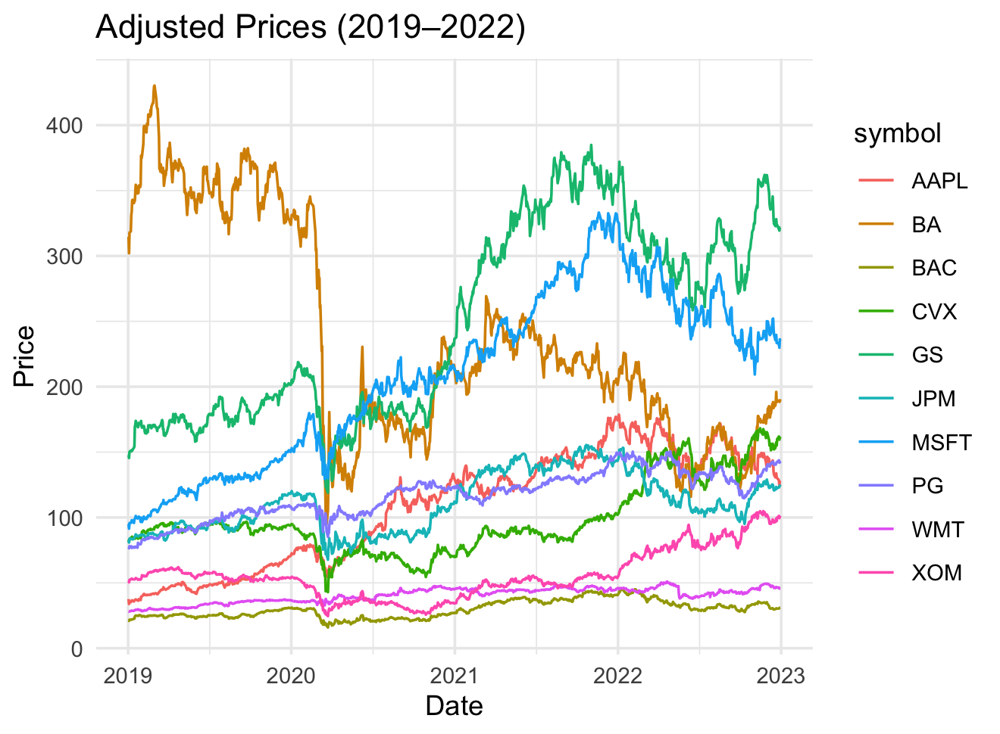
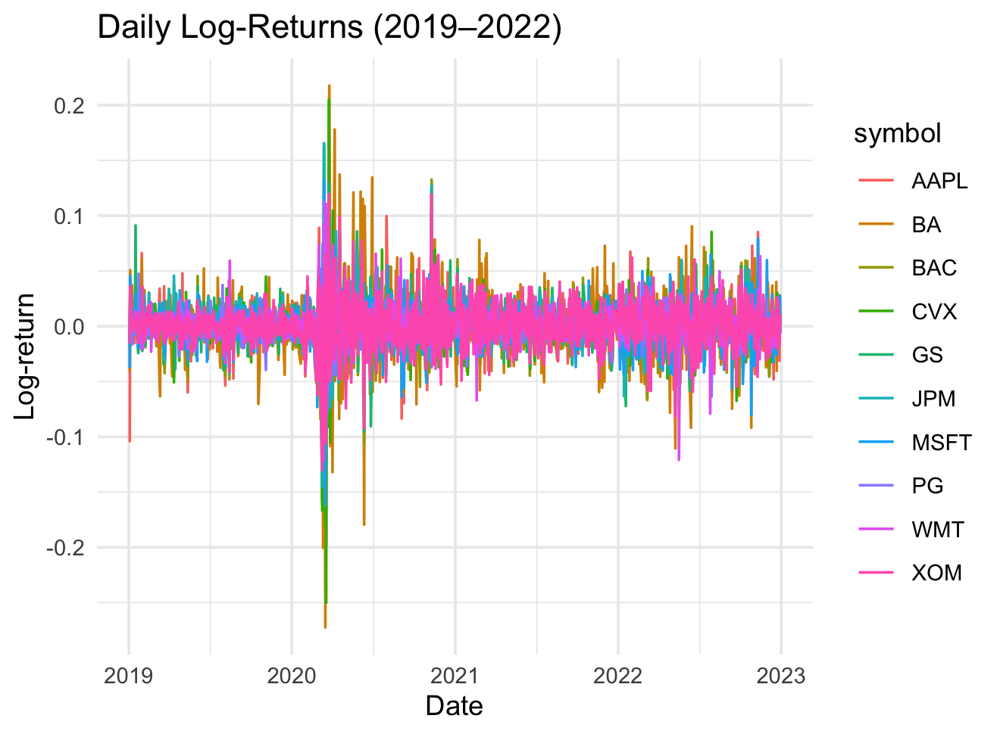
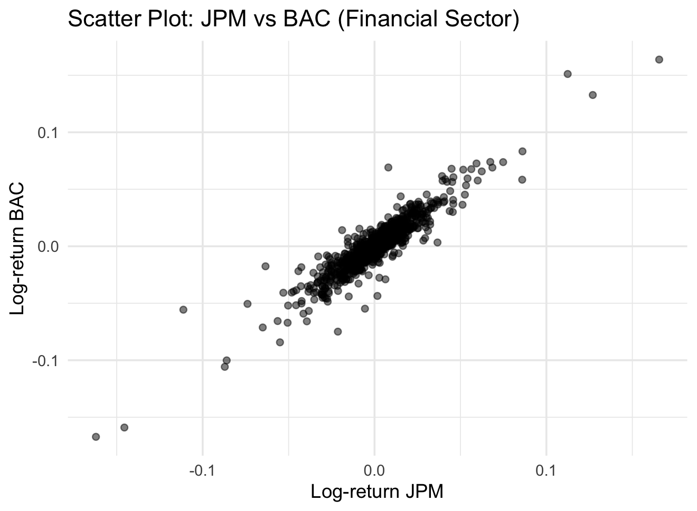
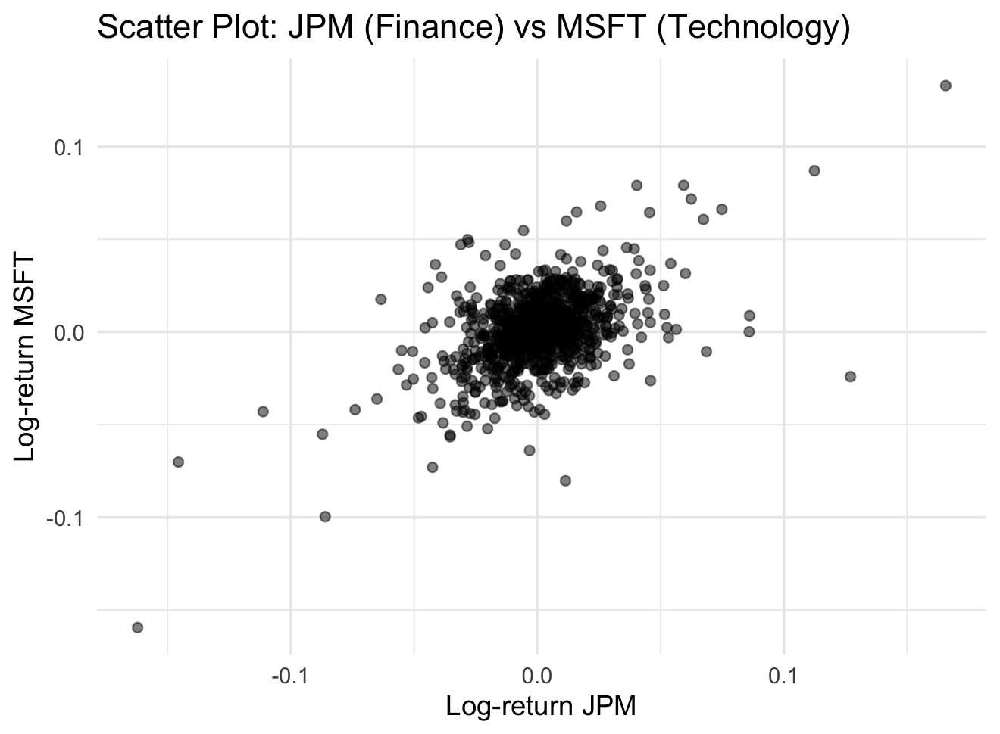
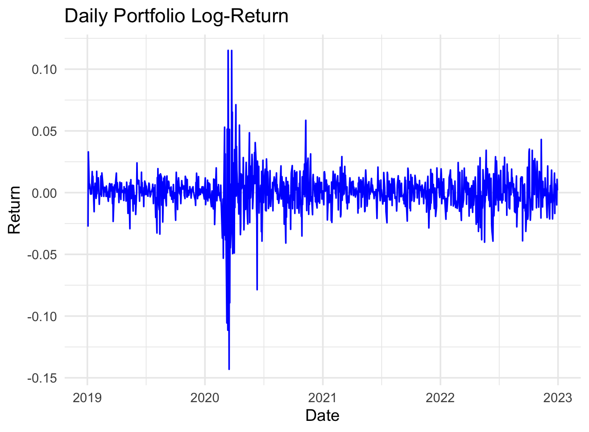

#  ME317 Project Report  
### *What Happened During the COVID-19 Pandemic?*

**Author**: Fabio Antonicoli  
**Date**: July 27, 2025  

---

##  Introduction

The COVID-19 outbreak in early 2020 triggered a period of extreme volatility in global stock markets.  
This report analyzes the performance of 10 diversified US stocks from 2019 to 2023 using techniques from the ME317 course:

- Market dynamics
- Risk modeling with Value-at-Risk (VaR)
- Dependence structures with copulas

---

##  1. Data and Stock Selection

We selected 10 major stocks from various sectors:

- **Financials**: JPM, BAC, GS  
- **Tech & Industrial**: AAPL, MSFT, BA  
- **Consumer & Energy**: WMT, PG, XOM, CVX

Historical data was collected from January 1, 2019, to December 31, 2022, using the `tidyquant` R package.

---

##  2. Market Dynamics During the Pandemic

###  Adjusted Prices  
Sharp declines occurred between February and March 2020 due to lockdowns and uncertainty.

###  Daily Log-Returns  
Spikes in volatility are clearly visible during the early pandemic period.

---

##  3. Sector Relationships and Diversification

###  JPM vs BAC (Same Sector - Financials)  
Strong linear correlation between the two banks.

###  JPM vs MSFT (Different Sectors)  
Weaker correlation due to cross-sector diversification.

**Insight**: Correlation increases during crises, reducing the effectiveness of diversification.

---

##  4. Portfolio Construction and VaR Estimation

We created an equally weighted portfolio (\$1000 in each stock) and calculated the daily portfolio return.

###  Portfolio Log-Returns

**1-Day VaR at 95% Confidence Level:**

- **Empirical VaR**: −2.24%  
- **Normal VaR**: −2.66%

---

##  5. Backtesting with 2023 Data

Out of 251 trading days in 2023:

- **Observed VaR violations**: 1  
- **Expected at 5%**: ~12  
- **Conclusion**: Model is **conservative** in the post-COVID market.

**Kupiec Test Result:**

- Likelihood Ratio: 11.83  
- p-value: 0.0006  
- **Verdict**: Reject the null — the model overestimates risk.

---

## 📈 6. Copula Analysis (JPM, BAC, GS)

To model dependency between financial institutions, we applied copulas to pseudo-observations.

###  AIC Comparison (Multivariate)

| Copula Model | AIC     |
|--------------|---------|
| Gaussian     | -3219   |
| Student-t    | **-3423** |
| Clayton      | -2499   |
| Gumbel       | -2993   |

**Best fit**: Student-t copula (captures joint tail risk)

---

##  7. Bivariate Copula (JPM vs BAC)

###  Log-Likelihood Comparison

| Copula Model | Log-Likelihood |
|--------------|----------------|
| Gaussian     | 928            |
| Student-t    | **990**        |
| Gumbel       | 952            |
| Clayton      | 752            |

- **Spearman’s rho**: 0.91  
- **Kendall’s tau**: ~0.925  
- Strong co-movement in crisis periods

---

##  Conclusion

- COVID-19 led to systemic risk and high volatility  
- Diversification failed during stress periods  
- Empirical VaR was conservative post-crisis  
- Student-t copula best captured joint risk

---

##  Appendix

- Full R code available in [`R_script.R`](R_script.R)
- Data source: Yahoo Finance via `tidyquant`

---

##  Contact

Feel free to open an issue or pull request for feedback or collaboration.
